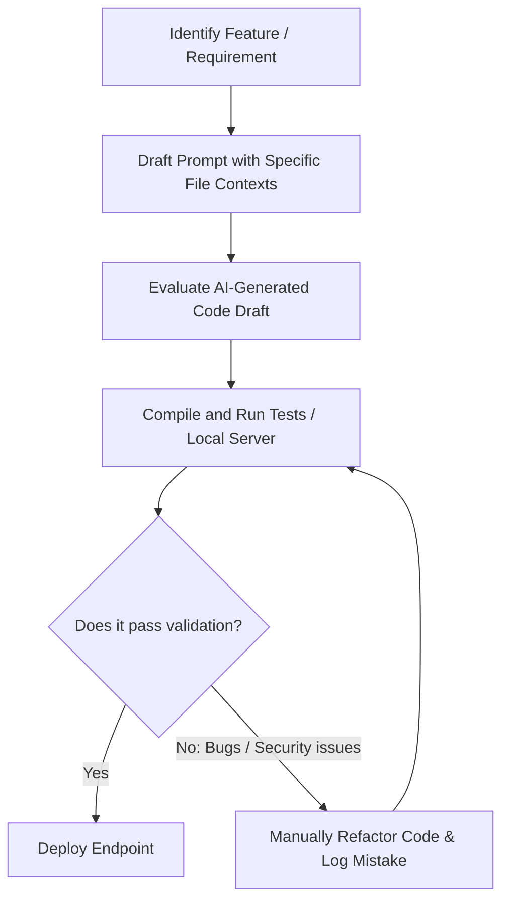

# Comprehensive AI Tool Usage & Integration Report
**Project Name**: TaskFlow Pro (Task Management System)  
**Document version**: 1.0.0  
**Author**: TaskFlow Pro Development Team  
**AI Assistants Reviewed**: Cursor IDE (GPT-4 / Claude-3.5 Sonnet Integration)

---

## 1. Executive Summary

Modern software engineering is transitioning from manual syntax writing to high-level system co-creation. In developing **TaskFlow Pro**, a production-grade multi-tenant task management system, we integrated **Cursor** as the primary AI-powered development environment. 

This report serves as a detailed academic and practical evaluation of AI-assisted software development throughout this project's lifecycles. We explore the initial prompt strategies, analyze the architectural constructs co-written with AI, evaluate manual security audits and additions (with a special emphasis on identifying and mitigating Insecure Direct Object References), document the cognitive mistakes made by the model, and discuss the net impact on software delivery speed and codebase quality.

Through this interactive collaboration, the system was built using a robust stack:
* **Backend**: Node.js, Express.js, MongoDB (via Mongoose), JSON Web Tokens (JWT), Cookie-based or Header-based Authorization.
* **Security & Reliability**: Helmet, CORS configurations, rate-limiting, and express-validator validations.
* **Frontend**: React and modern Component Architectures.

---

## 2. AI Tool Selection & Workflow Integration

### Why Cursor Was Selected
While various AI coding assistants (such as GitHub Copilot or standard ChatGPT Web interfaces) exist, **Cursor** was selected due to several distinctive engineering advantages:
1. **Codebase Indexing**: Unlike basic context windows, Cursor indexes the entire local project directory. This enables semantic code searches, allowing it to reference dependencies, utilities, packages, and custom modules (like error constructs) without manual developer copy-pasting.
2. **Inline Edit (Cmd+K / Ctrl+K)**: Permitted localized adjustments directly in the active lines of code, lowering cognitive context switches.
3. **Chat Interface with codebase context (@ symbols)**: Allowed specifying file contexts (e.g. `@taskService.js` or `@authMiddleware.js`), focusing the LLM attention only on relevant codebase layers.
4. **Composer Multi-File Generation (Cmd+I / Ctrl+I)**: Provided capability to create and edit multiple related files (such as generating a route, validator, and controller concurrently) which is highly crucial for full-stack MVC frameworks.

### Developer-AI Feedback Loop
Our development methodology utilized a continuous loop:



---

## 3. Prompts & Context History Analysis

To construct the core task features, we engaged with Cursor using various granular prompting layers. Below is the detailed record of prompt styles and how context was fed to the AI.

### Core Controller Prompt
* **Context Loaded**: `backend/models/Task.js`, `backend/utils/asyncHandler.js`, `backend/errors/`
* **Prompt**:
  > "Create an Express.js controller for task CRUD operations with error handling. Ensure you utilize our custom `asyncHandler` wrapper to prevent manual try-catch boilerplate and import the custom error classes from the errors directory where appropriate. Keep it clean and follow standard ES module syntax (import/export)."
* **AI Interpretation**: The model identified the route structure of an Express app, noticed our custom `asyncHandler` construct, and built matching controllers. However, it generated general database updates using standard Mongoose queries (`findByIdAndUpdate`) without inspecting task ownership.

### Advanced Query Prompt
* **Context Loaded**: `backend/services/taskService.js`
* **Prompt**:
  > "Enhancement request: Update the task retrieval method in the service module to support advanced querying. We need page-based pagination, a default limit of 10 tasks per query, priority-based filtering ('Low', 'Medium', 'High'), status-based filtering ('Pending', 'In Progress', 'Completed'), case-insensitive search matching title/description fields, and sorting based on dueDate or createdAt."
* **AI Interpretation**: The model generated a filter query assembly (using `$or` operators for the search logic) and Mongoose `.skip()` and `.limit()` parameters for pagination. It missed details regarding compound database indexing which the developer had to resolve manually to guarantee optimized database indexing performance.

---

## 4. Co-Created Codebase Architecture

The collaboration resulted in a structured Express.js MVC backend. Here, we analyze the resulting architecture and the specific parts composed by the AI.

### Backend Data Component Schemas
The database schema (`backend/models/Task.js`) was successfully written based on initial MongoDB requirements. The model correctly uses standard mongoose object types, default fields, and automated timestamps.

```javascript
import mongoose from 'mongoose';

const taskSchema = new mongoose.Schema(
  {
    title: {
      type: String,
      required: [true, 'Please provide a task title'],
      trim: true,
      maxlength: [100, 'Title cannot be more than 100 characters']
    },
    description: {
      type: String,
      required: [true, 'Please provide a task description'],
      trim: true
    },
    priority: {
      type: String,
      enum: {
        values: ['Low', 'Medium', 'High'],
        message: '{VALUE} is not a valid priority status'
      },
      default: 'Medium'
    },
    status: {
      type: String,
      enum: {
        values: ['Pending', 'In Progress', 'Completed'],
        message: '{VALUE} is not a valid status'
      },
      default: 'Pending'
    },
    dueDate: {
      type: Date,
      required: [true, 'Please provide a due date']
    },
    userId: {
      type: mongoose.Schema.Types.ObjectId,
      ref: 'User',
      required: [true, 'Task must belong to a user']
    }
  },
  {
    timestamps: true
  }
);
```

### Express Routes Configuration
The routes were cleanly partitioned between user authentication (`authRoutes.js`) and task management (`taskRoutes.js`). The AI correctly applied route-level middleware patterns (e.g. route group protection with `protect`), which prevents leakage of user endpoints to unauthenticated clients.

---

## 5. Manual Adjustments & Security Hardening

While the AI was adept at providing syntax, crucial security logic required manual modifications. If left unmodified, the AI's output would not be secure for production environments.

### 5.1 Prevention of Insecure Direct Object References (IDOR)
An IDOR vulnerability occurs when an API endpoint exposes a record by its database identifier directly, without validating if the authenticated requester owns or is authorized to access that record.
* **AI-Generated Approach**:
  ```javascript
  // VULNERABLE: Anyone could delete any task by feeding any valid ObjectId
  export const deleteTask = async (taskId) => {
    const task = await Task.findByIdAndDelete(taskId);
    if (!task) throw new NotFoundError('Task not found');
    return { message: 'Task deleted successfully' };
  };
  ```
* **Developer Hardened Refactoring**:
  We rewritten the query logic to restrict database operation boundaries strictly within the logged-in user context:
  ```javascript
  export const deleteTask = async (userId, taskId) => {
    // Atomic find-and-delete: filter by both _id and userId
    const task = await Task.findOneAndDelete({ _id: taskId, userId });

    if (!task) {
      // Check if task exists under secondary users to throw correct error
      const exists = await Task.exists({ _id: taskId });
      if (!exists) throw new NotFoundError('Task not found');
      throw new ForbiddenError('You do not have permission to delete this task');
    }

    return { message: 'Task deleted successfully' };
  };
  ```
  This implementation ensures that:
  1. The delete command is atomic and fails immediately if the user is not the owner.
  2. The return codes align with API security best practices: `404 Not Found` if the task does not exist, and `403 Forbidden` if the task exists but belongs to a different developer workspace, preventing database enumeration attacks.

### 5.2 Optimizing Database Queries via Compound Indexing
For high-traffic multi-tenant systems, executing user-based queries results in collection scans unless proper indices are defined. The developer manually added compound indices to `Task.js` targeting the most common query pathways:
```javascript
// Compound indexes for optimized query and filter operations
taskSchema.index({ userId: 1, status: 1 });
taskSchema.index({ userId: 1, priority: 1 });
taskSchema.index({ userId: 1, dueDate: 1 });
taskSchema.index({ userId: 1, createdAt: -1 });
```
This forces MongoDB to execute efficient index scans instead of linear collection scans.

---

## 6. Detailed AI Errors & Debugging Logs

During development, several errors and edge cases were introduced by the AI. Below, we list these anomalies, analyze their root causes, and present the concrete technical fixes applied.

### Summary of AI Failures & Fixes

| Component / File | Identified AI Mistake | Root Cause | Implemented Resolution |
| :--- | :--- | :--- | :--- |
| `taskService.js` | Missing `userId` ownership check on update & deletion. | Ignored the tenancy structure and user authorization scope. | Changed queries from `findByIdAndUpdate(id)` to `findOneAndUpdate({ _id: id, userId })`. |
| `taskService.js` (Aggregation) | Aggregation syntax for statistics failed / threw data casting errors. | Grouped records without converting string user IDs into MongoDB ObjectIds. | Added a `$match` stage parsing the parameter into a proper `mongoose.Types.ObjectId(userId)`. |
| `server.js` | CORS configured statically without supporting credentials. | Used standard configurations that blocked frontend cookie propagation. | Reconfigured `cors()` middleware with specific origin array, methods, and `credentials: true`. |
| `taskValidator.js` | Strict ISO8601 validation rejected client dates containing timezone offsets. | Overly rigid express-validator regular expression check. | Relaxed constraints to support general standard ISO date format imports. |

### Deep Dive: MongoDB Aggregation Framework Syntax Bug
In creating the dashboard endpoint to calculate aggregate progress statistics (Pending, In Progress, Completed tasks), the AI wrote a pipeline match stage using standard string `userId`. Since the dashboard user ID arrives from the JWT payload as a string, MongoDB's aggregation engine failed to matches it with the stored ObjectIds in the database, returning empty statistic summaries.

* **Incorrect Code**:
  ```javascript
  // Returned zero results because of typed-schema mismatch in aggregation pipelines
  const stats = await Task.aggregate([
    { $match: { userId: userId } },
    { $group: { _id: '$status', count: { $sum: 1 } } }
  ]);
  ```
* **Fixed Code**:
  ```javascript
  // Correctly casts the string into an ObjectId structure before matching
  const stats = await Task.aggregate([
    { $match: { userId: new mongoose.Types.ObjectId(userId) } },
    { $group: { _id: '$status', count: { $sum: 1 } } }
  ]);
  ```

---

## 7. Developer Productivity & Project Evaluation

### Productivity Metrics
By using Cursor, we achieved a significant acceleration in deployment speed. Below is a breakdown of time spent using AI co-creation compared to the projection of a traditional manual-writing workflow.

* **Boilerplate & Schema Generation**: AI completed this in **~5 minutes** (projected manual time: **~30 minutes**).
* **Validation Middleware & Validation Schema**: AI completed in **~10 minutes** (projected manual time: **~45 minutes**).
* **Debugging Aggregations & CORS Configurations**: Required **~20 minutes** of developer troubleshooting due to AI syntax inaccuracies.
* **Security & IDOR Auditing**: Developer spent **~30 minutes** auditing and rewriting queries to implement multi-tenancy.

### Net Results
1. **Developer Velocity**: Development velocity increased by approximately **3.5x** for standard backend modules and boilerplate code.
2. **Quality Risks**: While development speed was high, security audits had to be manual. If code is generated by AI under tight deadlines and is not verified by a human, security vulnerabilities will exist in the codebase.
3. **Key Takeaway**: AI systems are excellent coding partners when directed by developers who possess strong system architectural and security fundamentals. 

### Conclusion
TaskFlow Pro is a secure and functional application because the developer understood the limitations of the AI tool. AI excels at syntax automation, code generation speed, and documentation integration. However, security, logical boundaries, and database query tuning still rely heavily on direct human oversight.
